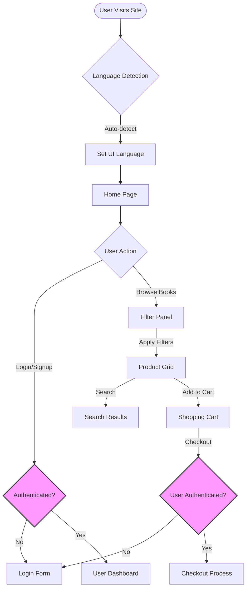

## Main User Flow

```mermaid
graph TB
    Start([User Visits Site]) --> Lang{Language Detection}
    Lang -->|Auto-detect| SetLang[Set UI Language]

    SetLang --> Home[Home Page]
    Home --> Browse{User Action}

    %% Authentication Flow
    Browse -->|Login/Signup| Auth{Authenticated?}
    Auth -->|No| LoginForm[Login Form]
    Auth -->|Yes| UserDash[User Dashboard]

    %% Browse and Filter Flow
    Browse -->|Browse Books| Filter[Filter Panel]
    Filter -->|Apply Filters| Products[Product Grid]
    Products -->|Search| Search[Search Results]

    %% Shopping Cart Flow
    Products -->|Add to Cart| Cart[Shopping Cart]
    Cart -->|Checkout| CheckAuth{User Authenticated?}
    CheckAuth -->|No| LoginForm
    CheckAuth -->|Yes| Checkout[Checkout Process]

    classDef flow fill:#f9f,stroke:#333,stroke-width:2px
    class Auth,CheckAuth flow
```